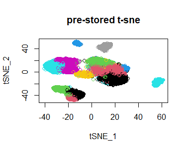
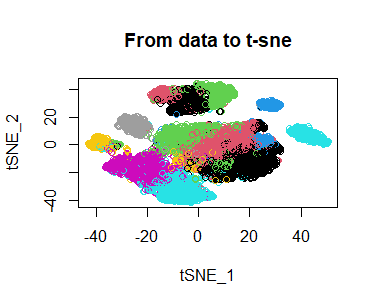

```{r setup, include=FALSE}
knitr::opts_chunk$set(echo = FALSE)
```

## Steps to Plot the t-sne Figure in Original Paper

- The t-sne figure in original paper can be reproduced from the t-sne result matrix pre-stored by author on https://www.dropbox.com/sh/dn4gwdww8pmfebf/AACXYu8rda5LoLwuCZ8aZXfma?dl=0.

- The instruction can be found on the project github: https://github.com/cssmillie/ulcerative_colitis

- The figure is exactly same as figure C in p.715 for Stromal (Fib) in https://www.cell.com/cell/pdf/S0092-8674(19)30732-9.pdf

## The t-sne Figure Plot from Pre-stored Result



## Reproduce the t-sne Figure from the Data 

Then we reproduce the t-sne from the pre-stored data and code showed in this repository in "new_comparison.R"




